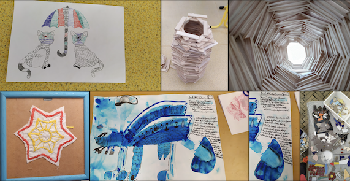
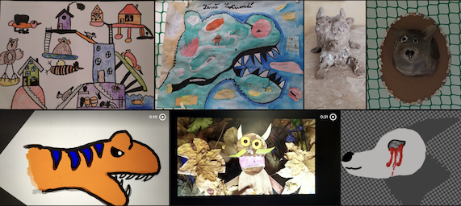
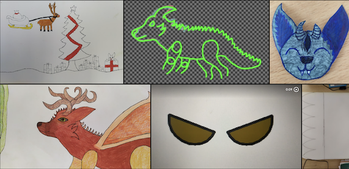
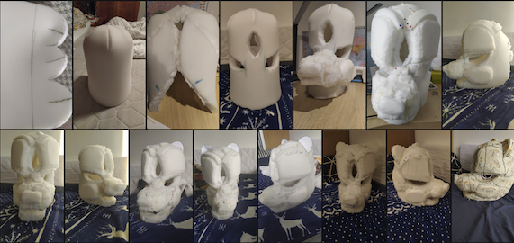
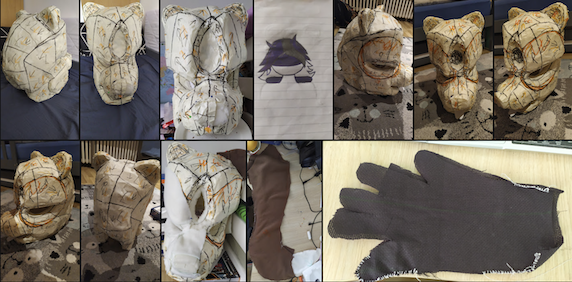
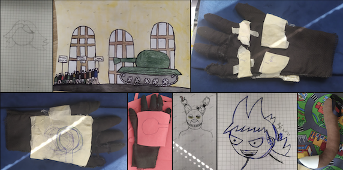
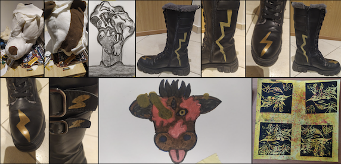
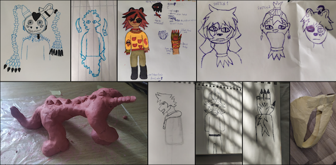
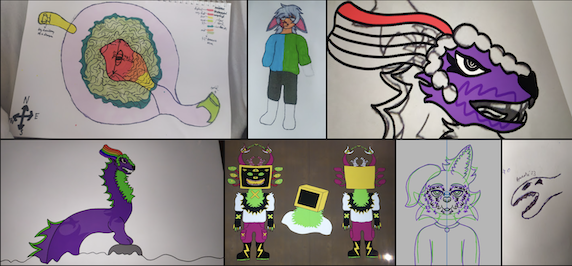
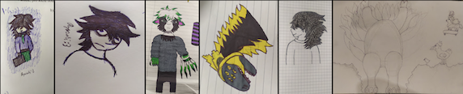

# Eliška Šamonilová

## Portfólio pro SSPŠ 2026/2027

### Grafická tvorba

ve plné kvalitě k nahlednutí [zde](https://photos.google.com/share/AF1QipMOB8Go95HJsmHLL1dkKGqu-g-1ceQhD_7ySPLZSP775C7d1rGU-9gaAQngLD96uA?key=M1Eta2ViaXlMZWVWYVE5T2RtbmNDWnU3ekhINzBn)

### Webové stránky

- Random cat: webová stránka o kočkách, zdrojové soubory [zde](./randomcat/readme.md), ukázka běžícího webu [zde](https://a-random-cat-site.neocities.org)
- Restaurace Ambrosie: webová stránka neexistující restaurace, vytvořeno v týmu 5 lidí s pomocí AI, zdrojové kódy [zde](./ambrosie/readme.md), ukázka běžícího webu [zde](https://restaurace-ambrosie.neocities.org)

### Dabing

- Nadabovala jsem postavu kočky v kazetě 70 v audio seriálu “Díra”, 2025. Vybrali si mě autoři na základě mé nahrávky. Celé ke shlédnutí [zde](https://www.youtube.com/watch?v=V4tyI_K5KWg), moje úseky například [zde](https://youtu.be/V4tyI_K5KWg?t=563) a [zde](https://youtu.be/V4tyI_K5KWg?t=672)
